# 📞 Contact App

## Overview
A Flutter-based contact management app with platform-specific UI for iOS and Android. The app allows users to switch between iOS and Android views through the settings. It supports dark and light modes, hidden contacts, and fingerprint lock for securing contact details.

## ✨ Features
- **Platform-Specific UI**: Unique layouts and components for iOS and Android.
- **View Switching**: Seamlessly toggle between iOS and Android views via in-app settings.
- **Dark & Light Mode**: Fully supports both themes.
- **Hidden Contacts**: Hide selected contacts for added privacy.
- **Fingerprint Lock**: Securely access hidden contacts and details using biometric authentication.

## 🚀 Installation
1. Clone the repository:
   ```bash
   git clone https://github.com/your-repo/contact-app.git
   cd contact-app
Install dependencies:

bash
Copy
Edit
flutter pub get
Run the app:

bash
Copy
Edit
flutter run
📋 Requirements
Flutter 3.x
Dart 2.x
Android SDK & Xcode (for iOS)
Emulator or real device for testing
🖼️ ScreenShots
### Intro Screen
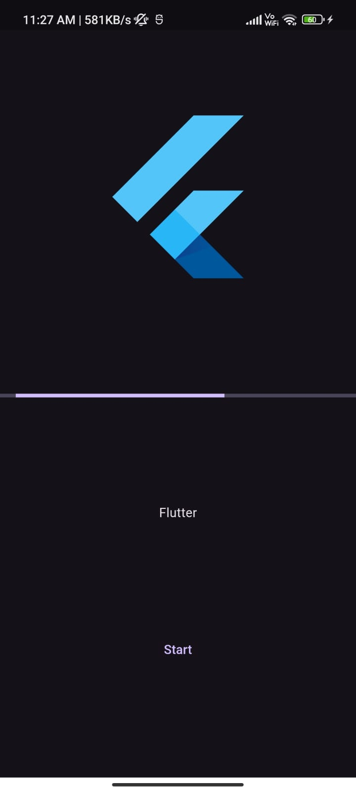
### Home Screens
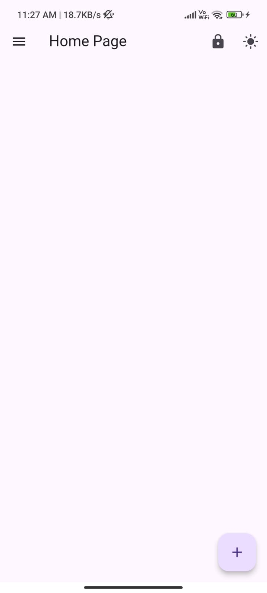
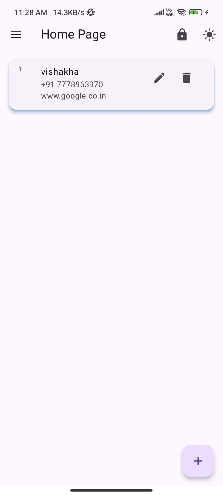
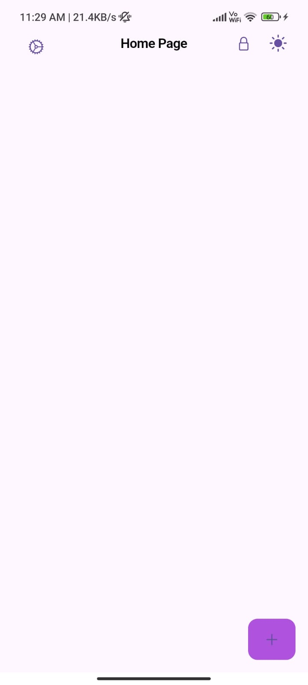
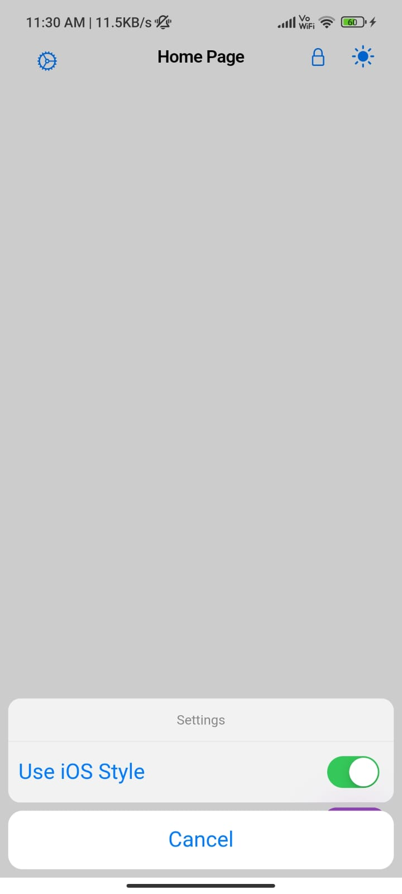
### Add Contact Screens
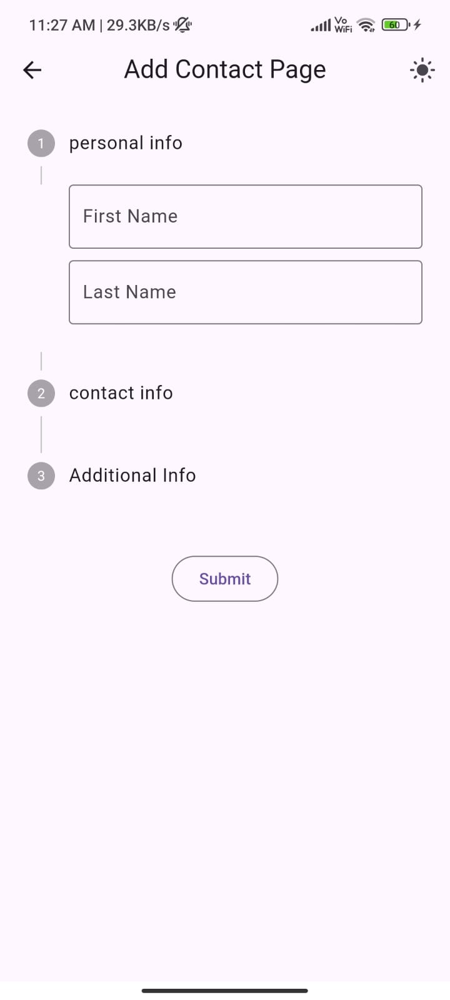

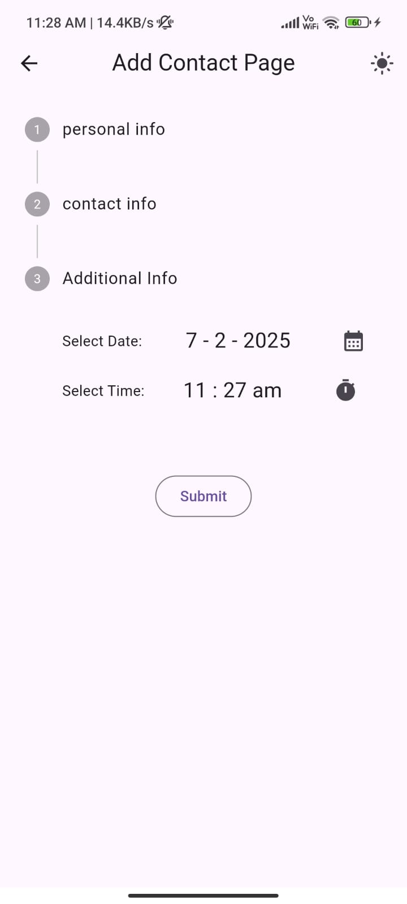
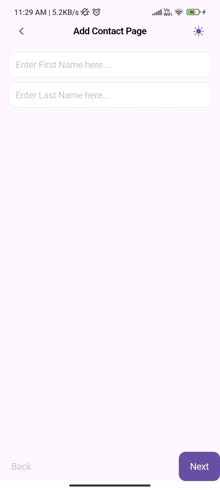
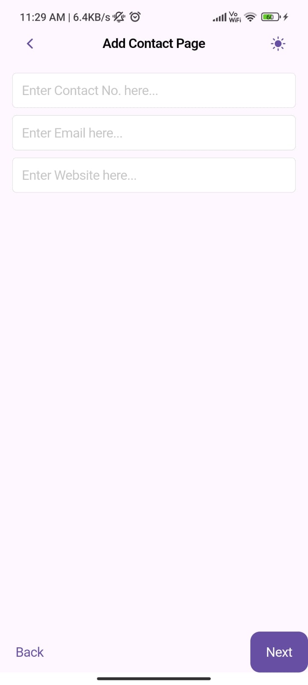
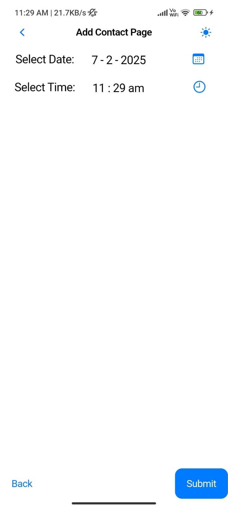
### Detail contact Screens

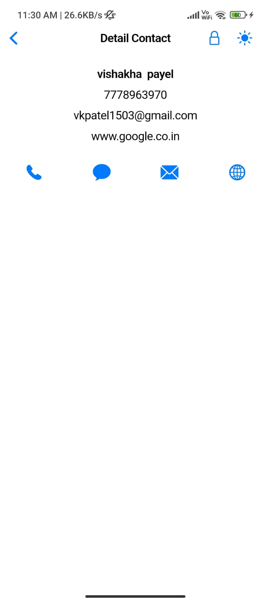
### Edit Page
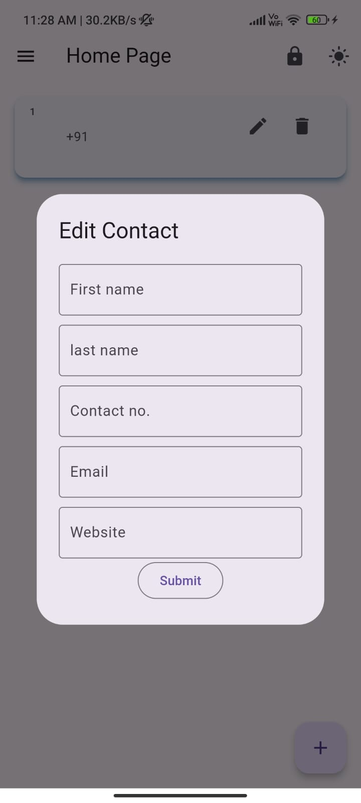
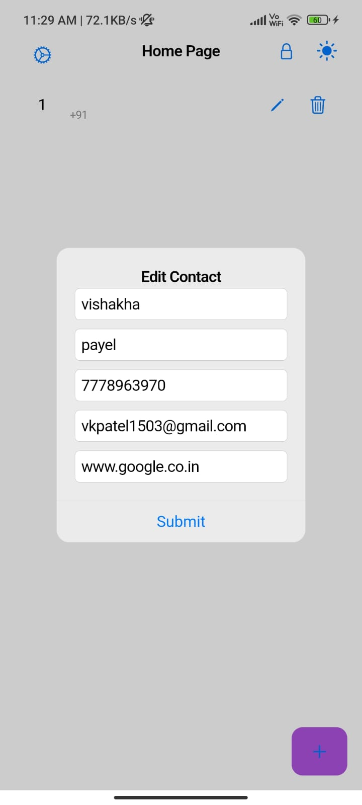
### Hidden contact Screen with Authentication
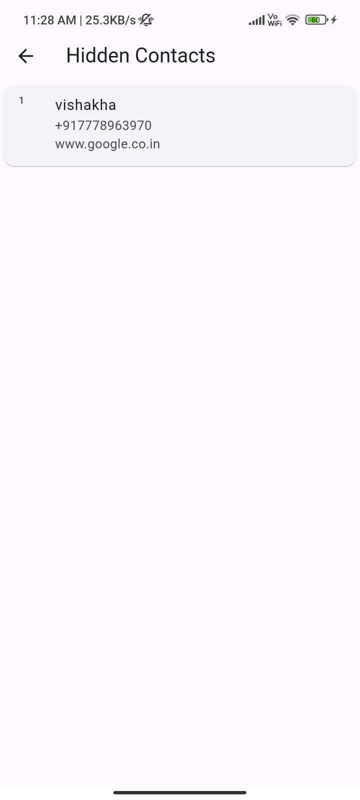
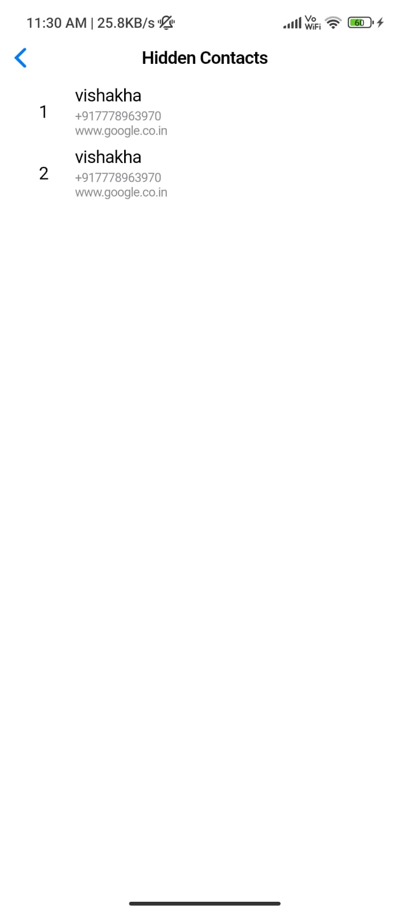
### Switcher for android ios view
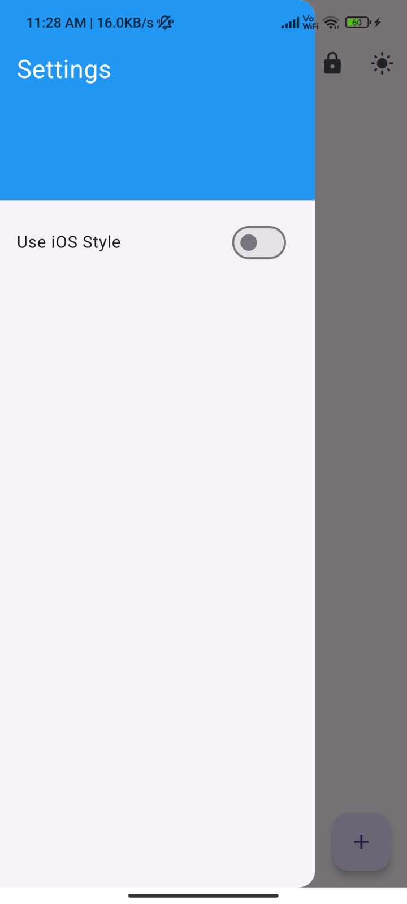


📥 APK Download
Download the latest APK

🤝 Contributing
Pull requests are welcome! For major changes, please open an issue first to discuss your proposal.

📜 License
This project is licensed under the MIT License.

vbnet
Copy
Edit

You can copy and paste this into a `README.md` file in your project. It’s styled for readabil
